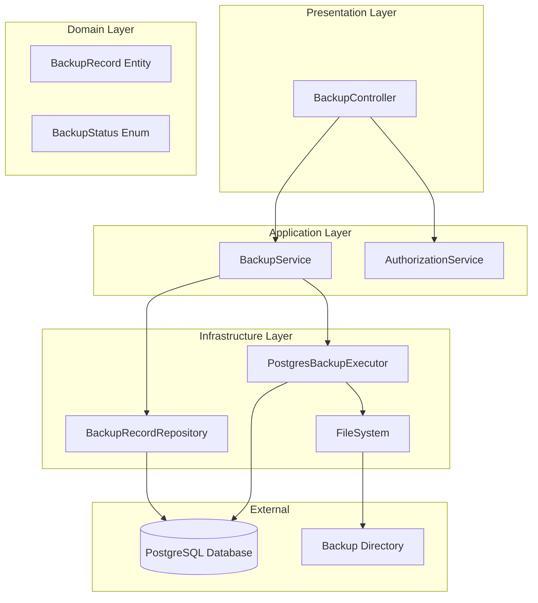

# Design Document: Database Backup and Recovery

## Overview

This design describes the implementation of database backup and recovery functionality for super administrators in the IntelliQuiz system. The feature enables creating PostgreSQL database dumps, managing backup history, downloading backup files, and restoring the database from selected backups.

The implementation follows the existing hexagonal architecture pattern with domain entities, application services, and REST API controllers. All operations are restricted to users with SUPER_ADMIN role.

## Architecture



### Component Responsibilities

- **BackupController**: REST API endpoints for backup operations, handles HTTP requests/responses
- **BackupService**: Orchestrates backup/restore operations, manages backup records
- **AuthorizationService**: Verifies SUPER_ADMIN role (existing service, extended)
- **PostgresBackupExecutor**: Executes pg_dump and pg_restore commands
- **BackupRecordRepository**: JPA repository for backup metadata persistence

## Components and Interfaces

### REST API Endpoints

```
POST   /api/backups              - Create new backup
GET    /api/backups              - List all backups
GET    /api/backups/{id}         - Get backup details
GET    /api/backups/{id}/download - Download backup file
POST   /api/backups/{id}/restore - Restore from backup
DELETE /api/backups/{id}         - Delete backup
```

### BackupController

```java
@RestController
@RequestMapping("/api/backups")
@Tag(name = "Database Backup", description = "Database backup and recovery operations (Super Admin only)")
public class BackupController {
    
    @PostMapping
    @Operation(summary = "Create database backup")
    public ResponseEntity<BackupRecordDTO> createBackup(@AuthenticationPrincipal User user);
    
    @GetMapping
    @Operation(summary = "List all backups")
    public ResponseEntity<List<BackupRecordDTO>> listBackups(@AuthenticationPrincipal User user);
    
    @GetMapping("/{id}")
    @Operation(summary = "Get backup details")
    public ResponseEntity<BackupRecordDTO> getBackup(@PathVariable Long id, @AuthenticationPrincipal User user);
    
    @GetMapping("/{id}/download")
    @Operation(summary = "Download backup file")
    public ResponseEntity<Resource> downloadBackup(@PathVariable Long id, @AuthenticationPrincipal User user);
    
    @PostMapping("/{id}/restore")
    @Operation(summary = "Restore database from backup")
    public ResponseEntity<BackupRecordDTO> restoreBackup(@PathVariable Long id, @AuthenticationPrincipal User user);
    
    @DeleteMapping("/{id}")
    @Operation(summary = "Delete backup")
    public ResponseEntity<Void> deleteBackup(@PathVariable Long id, @AuthenticationPrincipal User user);
}
```

### BackupService Interface

```java
public interface BackupService {
    
    BackupRecord createBackup();
    
    List<BackupRecord> listBackups();
    
    Optional<BackupRecord> getBackup(Long id);
    
    Resource downloadBackup(Long id);
    
    BackupRecord restoreFromBackup(Long id);
    
    void deleteBackup(Long id);
}
```

### PostgresBackupExecutor Interface

```java
public interface PostgresBackupExecutor {
    
    /**
     * Creates a PostgreSQL dump file.
     * @param outputPath the path where the dump file will be created
     * @return the size of the created file in bytes
     * @throws BackupException if the dump operation fails
     */
    long createDump(Path outputPath);
    
    /**
     * Restores the database from a dump file.
     * @param backupPath the path to the backup file
     * @throws BackupException if the restore operation fails
     */
    void restoreFromDump(Path backupPath);
}
```

### AuthorizationService Extension

```java
// Add to existing AuthorizationService
public void requireSuperAdmin(User user) {
    if (!user.isSuperAdmin()) {
        throw new AuthorizationException("This operation requires super admin privileges");
    }
}
```

## Data Models

### BackupRecord Entity

```java
@Entity
@Table(name = "backup_record")
public class BackupRecord {
    
    @Id
    @GeneratedValue(strategy = GenerationType.IDENTITY)
    private Long id;
    
    @Column(nullable = false, unique = true)
    private String filename;
    
    @Column(nullable = false)
    private LocalDateTime createdAt;
    
    @Column(nullable = false)
    private Long fileSizeBytes;
    
    @Enumerated(EnumType.STRING)
    @Column(nullable = false)
    private BackupStatus status;
    
    @Column
    private String errorMessage;
    
    @Column
    private LocalDateTime lastRestoredAt;
    
    @ManyToOne
    @JoinColumn(name = "created_by_user_id")
    private User createdBy;
}
```

### BackupStatus Enum

```java
public enum BackupStatus {
    IN_PROGRESS,
    SUCCESS,
    FAILED
}
```

### BackupRecordDTO

```java
public record BackupRecordDTO(
    Long id,
    String filename,
    LocalDateTime createdAt,
    Long fileSizeBytes,
    BackupStatus status,
    String errorMessage,
    LocalDateTime lastRestoredAt,
    String createdByUsername
) {
    public static BackupRecordDTO fromEntity(BackupRecord record) {
        return new BackupRecordDTO(
            record.getId(),
            record.getFilename(),
            record.getCreatedAt(),
            record.getFileSizeBytes(),
            record.getStatus(),
            record.getErrorMessage(),
            record.getLastRestoredAt(),
            record.getCreatedBy() != null ? record.getCreatedBy().getUsername() : null
        );
    }
}
```

### Backup Filename Format

Backup files follow the naming convention:
```
intelliquiz_backup_YYYY-MM-DDTHH-mm-ss.sql
```

Example: `intelliquiz_backup_2026-01-13T14-30-00.sql`

### Configuration Properties

```properties
# Backup configuration
backup.directory=${BACKUP_DIR:./backups}
backup.postgres.host=${DB_HOST:localhost}
backup.postgres.port=${DB_PORT:5434}
backup.postgres.database=${DB_NAME:intelliquiz}
backup.postgres.username=${DB_USERNAME:postgres}
backup.postgres.password=${DB_PASSWORD:mysecretpassword}
```


## Correctness Properties

*A property is a characteristic or behavior that should hold true across all valid executions of a system—essentially, a formal statement about what the system should do. Properties serve as the bridge between human-readable specifications and machine-verifiable correctness guarantees.*

### Property 1: Authorization Enforcement

*For any* user without SUPER_ADMIN role and *for any* backup operation (create, list, download, restore, delete), the Backup_Service should reject the request with an AuthorizationException.

**Validates: Requirements 1.5, 2.3, 3.3, 4.5, 5.3**

### Property 2: Backup Filename Format

*For any* successfully created backup, the filename should match the pattern `intelliquiz_backup_YYYY-MM-DDTHH-mm-ss.sql` where the timestamp corresponds to the backup creation time.

**Validates: Requirements 1.2**

### Property 3: Backup Record Completeness

*For any* successfully completed backup operation, the resulting BackupRecord should contain: a non-null filename, a createdAt timestamp equal to or after the operation start time, a positive fileSizeBytes value, and SUCCESS status.

**Validates: Requirements 1.3**

### Property 4: Backup List Ordering

*For any* list of BackupRecords returned by listBackups(), the records should be ordered by createdAt timestamp in descending order (newest first).

**Validates: Requirements 2.1**

### Property 5: Download File Integrity

*For any* valid backup ID where the backup file exists on disk, downloading the backup should return a Resource with content matching the file on disk.

**Validates: Requirements 3.1**

### Property 6: Pre-Restore Safety Backup

*For any* restore operation initiated by a super admin, a new backup should be created before the restore begins, ensuring the pre-restore state can be recovered.

**Validates: Requirements 4.2**

### Property 7: Restore Timestamp Update

*For any* successfully completed restore operation, the source BackupRecord's lastRestoredAt field should be updated to a timestamp equal to or after the restore operation start time.

**Validates: Requirements 4.3**

### Property 8: Delete Removes Record and File

*For any* delete operation on a valid backup ID, after deletion completes: the BackupRecord should no longer exist in the repository, and the corresponding file should no longer exist on disk.

**Validates: Requirements 5.1**

## Error Handling

### Exception Types

```java
public class BackupException extends RuntimeException {
    public BackupException(String message) {
        super(message);
    }
    
    public BackupException(String message, Throwable cause) {
        super(message, cause);
    }
}

public class BackupNotFoundException extends RuntimeException {
    public BackupNotFoundException(Long id) {
        super("Backup not found with id: " + id);
    }
}

public class BackupFileNotFoundException extends RuntimeException {
    public BackupFileNotFoundException(String filename) {
        super("Backup file not found: " + filename);
    }
}
```

### Error Scenarios

| Scenario | Exception | HTTP Status | Response |
|----------|-----------|-------------|----------|
| Non-super-admin access | AuthorizationException | 403 Forbidden | Error message |
| Backup ID not found | BackupNotFoundException | 404 Not Found | Error message |
| Backup file missing on disk | BackupFileNotFoundException | 404 Not Found | Error message |
| pg_dump command fails | BackupException | 500 Internal Server Error | Error details |
| pg_restore command fails | BackupException | 500 Internal Server Error | Error details |
| Backup directory not writable | BackupException | 500 Internal Server Error | Error details |

### Global Exception Handler

```java
@RestControllerAdvice
public class BackupExceptionHandler {
    
    @ExceptionHandler(BackupNotFoundException.class)
    public ResponseEntity<ErrorResponse> handleBackupNotFound(BackupNotFoundException ex) {
        return ResponseEntity.status(HttpStatus.NOT_FOUND)
            .body(new ErrorResponse(ex.getMessage()));
    }
    
    @ExceptionHandler(BackupFileNotFoundException.class)
    public ResponseEntity<ErrorResponse> handleBackupFileNotFound(BackupFileNotFoundException ex) {
        return ResponseEntity.status(HttpStatus.NOT_FOUND)
            .body(new ErrorResponse(ex.getMessage()));
    }
    
    @ExceptionHandler(BackupException.class)
    public ResponseEntity<ErrorResponse> handleBackupException(BackupException ex) {
        return ResponseEntity.status(HttpStatus.INTERNAL_SERVER_ERROR)
            .body(new ErrorResponse(ex.getMessage()));
    }
}
```

## Testing Strategy

### Dual Testing Approach

This feature requires both unit tests and property-based tests for comprehensive coverage:

- **Unit tests**: Verify specific examples, edge cases, and error conditions
- **Property tests**: Verify universal properties across all inputs using jqwik

### Property-Based Testing Framework

The project uses **jqwik** for property-based testing in Java. Each property test will:
- Run minimum 100 iterations
- Reference the design document property it validates
- Use the tag format: **Feature: database-backup-recovery, Property {number}: {property_text}**

### Test Categories

#### Unit Tests
- Authorization rejection for each endpoint with non-super-admin user
- Successful backup creation with valid super admin
- Backup record creation with all required fields
- Download returns correct file content
- Delete removes both record and file
- Error handling for missing backup ID
- Error handling for missing backup file

#### Property Tests
- Property 1: Authorization enforcement across all operations
- Property 2: Filename format validation
- Property 3: Backup record completeness
- Property 4: List ordering verification
- Property 8: Delete completeness

#### Integration Tests
- End-to-end backup creation with actual pg_dump
- End-to-end restore with actual pg_restore
- Pre-restore backup creation during restore flow

### Test Data Generators

```java
@Provide
Arbitrary<User> nonSuperAdminUsers() {
    return Arbitraries.of(SystemRole.ADMIN)
        .map(role -> new User("testuser", "password123", role));
}

@Provide
Arbitrary<LocalDateTime> backupTimestamps() {
    return Arbitraries.longs()
        .between(0, System.currentTimeMillis())
        .map(Instant::ofEpochMilli)
        .map(instant -> LocalDateTime.ofInstant(instant, ZoneId.systemDefault()));
}

@Provide
Arbitrary<BackupRecord> validBackupRecords() {
    return Combinators.combine(
        Arbitraries.longs().greaterOrEqual(1),
        backupTimestamps(),
        Arbitraries.longs().between(1000, 1_000_000_000)
    ).as((id, timestamp, size) -> {
        BackupRecord record = new BackupRecord();
        record.setId(id);
        record.setCreatedAt(timestamp);
        record.setFileSizeBytes(size);
        record.setStatus(BackupStatus.SUCCESS);
        record.setFilename(generateFilename(timestamp));
        return record;
    });
}
```
