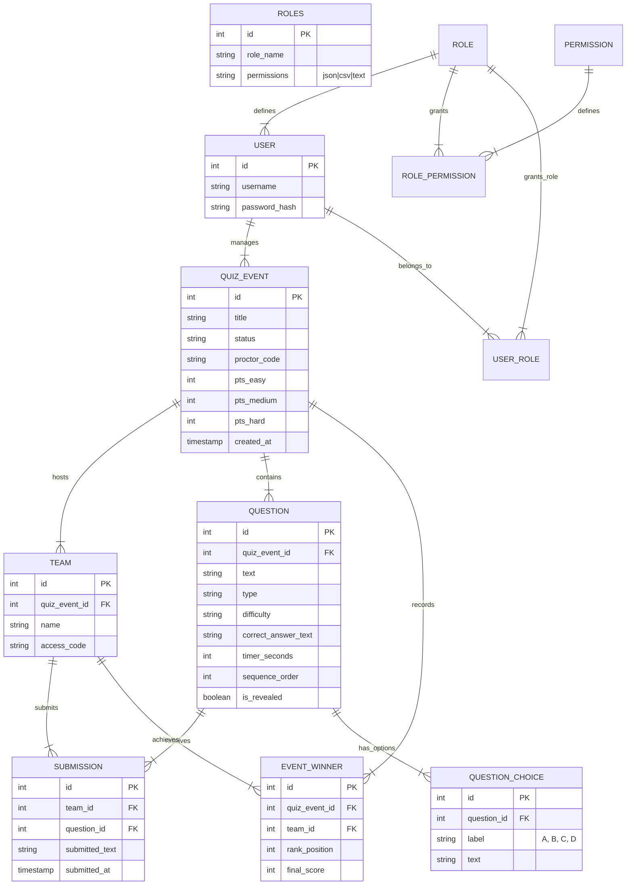

# Intelliquiz Backend - ER Diagram

Below is the mermaid ER diagram representation of the database schema for the Intelliquiz backend.

> ⚠️ Note: Mermaid ER syntax can differ slightly between versions; the code above uses mermaid's `erDiagram` notation and relationship symbols (e.g., `||--|{`). If your target renderer differs, small symbol changes may be needed.

---

If you'd like this saved as a different filename or in a different folder, tell me the desired path and I'll update it.
